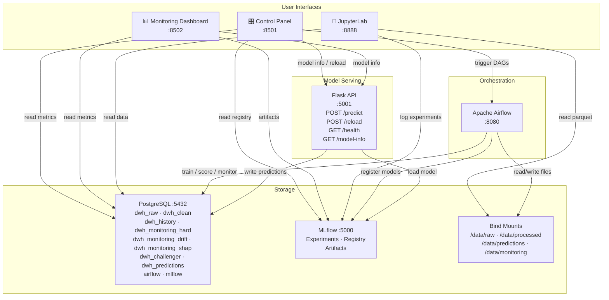
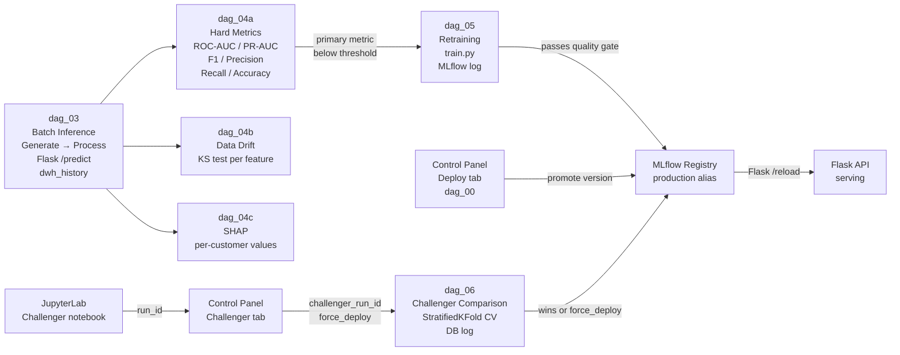
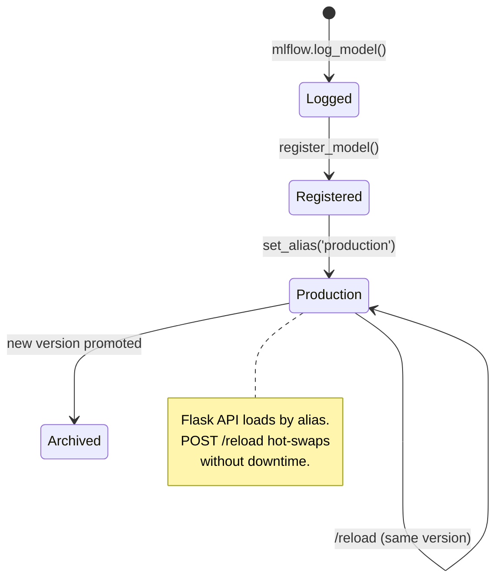

# MLOps Platform

A self-contained MLOps platform for credit-risk binary classification. Covers the full lifecycle: data generation, feature engineering, model training, serving, monitoring, and challenger comparison - all orchestrated through Apache Airflow and wired together with MLflow, PostgreSQL, and two Streamlit UIs.

```bash
docker compose up -d
```

**Endpoints after startup**

| Service | URL |
|---|---|
| Control Panel | http://localhost:8501 |
| Monitoring Dashboard | http://localhost:8502 |
| MLflow UI | http://localhost:5000 |
| Airflow UI | http://localhost:8080 |
| JupyterLab | http://localhost:8888 |
| Flask API | http://localhost:5001 |

---

## Architecture

### System Overview



### Data Flow



### Model Promotion Flow



---

## Services

| Container | Image / Build | Role |
|---|---|---|
| `mlops-postgres` | `postgres:15` | Primary relational store - all schemas |
| `mlops-mlflow` | `./infrastructure/mlflow` | Experiment tracking + model registry |
| `mlops-platform-init` | `./airflow` | One-shot bootstrap (idempotent) |
| `mlops-airflow-webserver` | `./airflow` | Airflow UI |
| `mlops-airflow-scheduler` | `./airflow` | DAG scheduler |
| `mlops-flask-api` | `./services/model_serving` | Gunicorn + Flask prediction API |
| `mlops-streamlit-ui` | `./services/streamlit_ui` | Control Panel (`control_panel.py`) |
| `mlops-streamlit-dashboard` | `./services/streamlit_ui` | Monitoring Dashboard (`dashboard.py`) |
| `mlops-jupyter` | `./infrastructure/jupyter` | JupyterLab for prototyping and EDA |

All containers share the `mlops-net` bridge network and run as `uid=50000` on bind-mounted volumes.

---

## DAGs

| DAG | Schedule | Trigger conf | Description |
|---|---|---|---|
| `dag_00_deploy_model` | manual | `model_version`, `model_stage` | Promote a specific MLflow model version to production alias, reload Flask |
| `dag_03_batch_inference` | manual | `n_records`, `drift_factor` | Generate → process → `/predict` → write `dwh_history`, auto-triggers dag_04a |
| `dag_04a_monitor_hard` | manual / auto | `run_index`, `skip_retrain_trigger` | Compute all 6 metrics, check primary metric threshold, trigger retraining |
| `dag_04b_monitor_drift` | manual | `run_index` | KS drift test per feature vs training reference distribution |
| `dag_04c_monitor_shap` | manual | `run_index` | SHAP explanations per customer - aggregate + per-record |
| `dag_05_retraining` | manual / auto | - | Hyperparameter search → train on all data → promote if quality gate passes |
| `dag_06_challenger_comparison` | manual | `challenger_run_id`, `force_deploy` | StratifiedKFold CV comparison of challenger vs production, log to DB |

---

## Metrics

All metrics are defined in `services/metrics.py` - single source of truth shared by DAGs, monitoring, and UIs.

| Key | Display | Notes |
|---|---|---|
| `roc_auc` | ROC-AUC | Default primary metric |
| `pr_auc` | PR-AUC | Preferred for imbalanced classes |
| `f1` | F1 | Harmonic mean of precision and recall |
| `precision` | Precision | TP / (TP + FP) |
| `recall` | Recall | TP / (TP + FN) |
| `accuracy` | Accuracy | Overall correctness |

The **primary metric** controls the retraining threshold check, the challenger comparison win condition, and the KPI cards in both UIs. Set it per model by tagging the MLflow run with `primary_metric=<key>` (done automatically by the challenger notebook and retraining DAG). Falls back to the `DEFAULT_PRIMARY_METRIC` env var (`roc_auc`).

---

## Database Schemas

```
mlops (database)
├── dwh_raw                   raw generated records
│   └── raw_loan_applications
├── dwh_clean                 feature-engineered records
│   └── cleaned_features
├── dwh_history               batch run registry + combined prediction/ground-truth
│   ├── run_registry          SERIAL run_index, one row per batch run
│   ├── prediction_ground_truth  features + prediction + actual default flag
│   └── retraining_log        audit trail of retraining events
├── dwh_monitoring_hard       per-run classification metrics (all 6 + primary_metric)
│   └── results
├── dwh_monitoring_drift      per-run feature drift results (KS test)
│   └── results
├── dwh_monitoring_shap       SHAP values - aggregate and per-customer
│   ├── results               feature_importances JSONB, top_feature
│   └── customer_shap_values  per-record SHAP vectors + base_value
├── dwh_challenger            challenger comparison audit log
│   └── comparison_log        CV scores, promotion decision, force_deploy flag
├── dwh_predictions           batch inference output (legacy, still populated)
│   └── batch_predictions
├── airflow                   Airflow metadata
└── mlflow                    MLflow backend store
```

---

## Configuration

Copy `.env.example` to `.env` and adjust. Key variables:

```bash
# Primary metric when no MLflow tag is present
DEFAULT_PRIMARY_METRIC=roc_auc

# Retraining triggers when primary metric drops below this
MIN_ROC_AUC=0.60

# Drift thresholds
MAX_DRIFT_SCORE=0.20
MAX_DRIFT_FEATURE_FRACTION=0.30

# Challenger comparison
CHALLENGER_CV_FOLDS=5
CHALLENGER_CV_MARGIN=0.05   # challenger must beat prod by this margin (absolute)

# Decision threshold for binary classification
DECISION_THRESHOLD=0.5
```

Generate a Fernet key for Airflow:
```bash
python -c "from cryptography.fernet import Fernet; print(Fernet.generate_key().decode())"
```

---

## Quick Start

```bash
# 1. Configure
cp .env.example .env
# Edit .env - set passwords, generate AIRFLOW__CORE__FERNET_KEY

# 2. Start
docker compose up -d

# 3. Wait for bootstrap (~60–120 s)
docker compose logs -f platform-init

# 4. Open Control Panel
#    http://localhost:8501
#    Pipelines tab → Batch Inference → Run

# 5. Monitor
#    http://localhost:8502
```

**Reset to clean state:**
```bash
docker compose down -v && docker compose up -d
```

---

## Challenger Workflow

1. Open JupyterLab at `http://localhost:8888`
2. Open `notebooks/01_challenger_template.ipynb`
3. Train a model, set `PRIMARY_METRIC`, log to MLflow
4. Copy the printed `run_id`
5. Open Control Panel → **Challenger** tab
6. Paste `run_id` - primary metric auto-detects from the MLflow run tag
7. Optionally enable **Force Deploy** to promote regardless of comparison result
8. Click **Run Challenger Comparison**
9. Airflow runs a 5-fold stratified CV comparison and logs results to `dwh_challenger.comparison_log`

---

## JupyterLab Notebooks

| Notebook | Purpose |
|---|---|
| `01_challenger_template.ipynb` | Train a challenger model, log to MLflow, get `run_id` for the Control Panel |
| `02_eda_and_feature_analysis.ipynb` | Explore the training dataset - distributions, correlations, default rates by segment, production prediction history |
| `03_production_model_analysis.ipynb` | Audit the current production model - all metrics, ROC/PR/calibration curves, confusion matrix, SHAP importance, version history, metric trend |

All notebooks connect to PostgreSQL and MLflow via environment variables pre-wired from `.env`.

---

## Project Structure

```
.
├── airflow/
│   ├── dags/                  DAGs 00, 03–06
│   ├── init.sh                Bootstrap script (idempotent)
│   └── Dockerfile
├── infrastructure/
│   ├── jupyter/Dockerfile     JupyterLab (uid 50000, mlflow==2.14.3)
│   ├── mlflow/Dockerfile      MLflow tracking server
│   └── postgres/
│       ├── init.sql           All schema definitions
│       └── 00_create_roles.sql
├── notebooks/
│   ├── 01_challenger_template.ipynb
│   ├── 02_eda_and_feature_analysis.ipynb
│   └── 03_production_model_analysis.ipynb
├── services/
│   ├── metrics.py             Shared metric catalogue
│   ├── monitoring/
│   │   ├── hard_metrics.py
│   │   ├── drift.py
│   │   └── shap_monitor.py
│   ├── model_serving/         Flask API + Dockerfile
│   └── streamlit_ui/
│       ├── control_panel.py   :8501
│       ├── dashboard.py       :8502
│       └── Dockerfile
├── training/
│   └── train.py               Hyperparameter search + training (all available data)
├── data/                      Bind-mounted (gitignored)
├── volumes/                   Persistent volumes (gitignored)
├── docker-compose.yml
├── .env.example
└── README.md
```

---

## Stack

| Component | Version |
|---|---|
| Python | 3.11 |
| Apache Airflow | 2.9 |
| MLflow | 2.14.3 |
| PostgreSQL | 15 |
| scikit-learn | latest |
| XGBoost | latest |
| Streamlit | latest |
| Flask / Gunicorn | latest |
| JupyterLab | latest |
